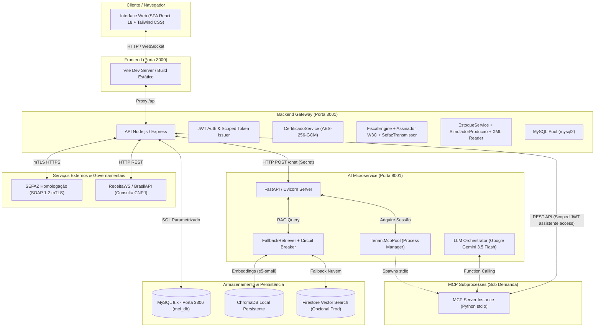

# MEI — Gestão Simplificada para Microempreendedores Individuais

> **Projeto Final • Formação Recode Pro AI**  
> Plataforma integrada de gestão operacional, produtiva, fiscal e financeira para Microempreendedores Individuais (MEI), potencializada por um **Assistente Virtual de Inteligência Artificial** com RAG semântico, transmissão oficial SEFAZ via **Certificado Digital A1** e Model Context Protocol (MCP) multi-tenant com paridade total de capacidades operacionais.

---

## 📌 Sumário
- [1. Visão Geral da Solução](#1-visão-geral-da-solução)
- [2. Topologia de Infraestrutura](#2-topologia-de-infraestrutura)
- [3. Arquitetura do Microserviço de IA & Sistema RAG](#3-arquitetura-do-microserviço-de-ia--sistema-rag)
  - [3.1 Orquestração LLM & Gemini](#31-orquestração-llm--gemini)
  - [3.2 Pipeline Completo de RAG Semântico](#32-pipeline-completo-de-rag-semântico)
  - [3.3 Corpus de Documentos Oficiais (MEI & CF88)](#33-corpus-de-documentos-oficiais-mei--cf88)
  - [3.4 Guia de Vetorização, Indexação e Consulta via CLI](#34-guia-de-vetorização-indexação-e-consulta-via-cli)
  - [3.5 Armazenamento Vetorial Híbrido & Resiliência](#35-armazenamento-vetorial-híbrido--resiliência)
  - [3.6 MCP Multi-Tenant e Catálogo de Ferramentas](#36-mcp-multi-tenant-e-catálogo-de-ferramentas)
- [4. Módulo Fiscal e Certificado Digital A1](#4-módulo-fiscal-e-certificado-digital-a1)
  - [4.1 Tipos de Documentos Suportados](#41-tipos-de-documentos-suportados)
  - [4.2 Certificado A1 Criptografado (AES-256-GCM)](#42-certificado-a1-criptografado-aes-256-gcm)
  - [4.3 Assinatura Digital W3C XMLDSig e SOAP mTLS SEFAZ](#43-assinatura-digital-w3c-xmldsig-e-soap-mtls-sefaz)
  - [4.4 Cancelamento Homologado e Estorno no Caixa](#44-cancelamento-homologado-e-estorno-no-caixa)
- [5. Módulo de Estoque, Produção e Fichas Técnicas](#5-módulo-de-estoque-produção-e-fichas-técnicas)
  - [5.1 Gestão de Insumos e Estoque Mínimo](#51-gestão-de-insumos-e-estoque-mínimo)
  - [5.2 Fichas Técnicas, CMV e Margens de Lucro](#52-fichas-técnicas-cmv-e-margens-de-lucro)
  - [5.3 Lotes de Produção e Simulação Preditiva](#53-lotes-de-produção-e-simulação-preditiva)
  - [5.4 Importação Automática por XML de NF-e](#54-importação-automática-por-xml-de-nf-e)
- [6. Segurança e Isolamento Multi-Tenancy](#6-segurança-e-isolamento-multi-tenancy)
- [7. Serviços, Portas e Variáveis de Ambiente](#7-serviços-portas-e-variáveis-de-ambiente)
- [8. Guia de Execução e Instalação Local](#8-guia-de-execução-e-instalação-local)
  - [8.1 Pré-requisitos](#81-pré-requisitos)
  - [8.2 Banco de Dados MySQL (Docker ou Nativo)](#82-banco-de-dados-mysql-docker-ou-nativo)
  - [8.3 Instalação de Dependências](#83-instalação-de-dependências)
  - [8.4 Configuração de Variáveis de Ambiente](#84-configuração-de-variáveis-de-ambiente)
  - [8.5 Migrações e Carga Inicial do Banco](#85-migrações-e-carga-inicial-do-banco)
  - [8.6 Inicialização do Ambiente Integrado](#86-inicialização-do-ambiente-integrado)
  - [8.7 Credenciais de Acesso de Demonstração](#87-credenciais-de-acesso-de-demonstração)
- [9. Suíte de Testes Automatizados (511 testes)](#9-suíte-de-testes-automatizados-511-testes)
- [10. API RESTful — Endpoints Principais](#10-api-restful--endpoints-principais)
- [11. Modelo de Dados Relacional (16 tabelas)](#11-modelo-de-dados-relacional-16-tabelas)

---

## 1. Visão Geral da Solução

O **MEI** unifica o fluxo comercial, produtivo, fiscal e financeiro do microempreendedor em uma única plataforma web integrada:

### Fluxo Comercial & Financeiro
$$\text{Cliente} \longrightarrow \text{Orçamento} \longrightarrow \text{Agendamento} \longrightarrow \text{Cobrança} \longrightarrow \text{Pagamento (Pix/Dinheiro)} \longrightarrow \text{Livro Caixa}$$

### Fluxo Produtivo & Estoque
$$\text{Insumos} \longrightarrow \text{Ficha Técnica (CMV)} \longrightarrow \text{Lote de Produção} \longrightarrow \text{Estoque de Produtos} \longrightarrow \text{Abate Automático na Venda}$$

### Fluxo Fiscal & SEFAZ
$$\text{Venda / Serviço} \longrightarrow \text{Criptografia AES-256} \longrightarrow \text{Assinatura W3C (Certificado A1)} \longrightarrow \text{SOAP mTLS SEFAZ / Emulador} \longrightarrow \text{DANFE com QR Code}$$

Além dos módulos operacionais tradicionais, o sistema incorpora:
1. **Assistente Virtual Inteligente (IA):**
   - Resolução de dúvidas fiscais e tributárias fundamentada estritamente na legislação oficial do MEI (`docs/perguntaomei.pdf`), citando número de páginas e percentual de relevância;
   - Consultas em tempo real sobre saldo de caixa, faturamento mensal/anual, pendências financeiras, estoque e notas fiscais emitidas;
   - **Execução operacional autônoma via linguagem natural** (cadastrar clientes, agendar compromissos, emitir cobranças, emitir notas fiscais, registrar compras de insumos, simular produção e controlar o certificado A1).
2. **Módulo Fiscal Multi-Estado com Certificado Digital ICP-Brasil A1:**
   - Emissão de NFS-e (Padrão Nacional), NF-e (produtos modelo 55) e NFC-e (consumidor modelo 65);
   - Suporte a certificados digitais A1 (`.pfx` / `.p12`) com criptografia simétrica de alta segurança (AES-256-GCM);
   - Assinatura digital padrão W3C XML Signature (RSA-SHA1) e comunicação com a SEFAZ em Homologação via SOAP sobre TLS Mútuo (mTLS);
   - Emulador fiscal local integrado para desenvolvimento sem necessidade de certificado real.
3. **Módulo de Estoque e Fichas Técnicas:**
   - Controle de insumos (g, ml, un) com recálculo automático de custo médio ponderado e alertas de estoque mínimo;
   - Fichas técnicas com cálculo de Custo de Mercadorias Vendidas (CMV) e sugestão de margem de lucro;
   - Simulação preditiva de capacidade produtiva e importação automática de compras via leitura de XML de NF-e.
4. **Módulo de Configurações Cadastrais do MEI:**
   - Consulta automatizada de CNPJ via ReceitaWS e BrasilAPI para preenchimento com 1 clique;
   - Configuração de domicílio fiscal, código IBGE municipal e parâmetros de séries fiscais.

---

## 2. Topologia de Infraestrutura

A infraestrutura do sistema é distribuída em três camadas de execução desacopladas:



---

## 3. Arquitetura do Microserviço de IA & Sistema RAG

O microserviço de inteligência artificial (`ai-service/`) roda em **Python 3.12+ com FastAPI e Uvicorn**, gerenciando a integração entre o modelo de linguagem (LLM), o pipeline de RAG vetorial e a execução de ferramentas corporativas via MCP.

### 3.1 Orquestração LLM & Gemini
- **Modelo:** Google Gemini (`gemini-3.5-flash-lite`), configurável via `GEMINI_MODEL`.
- **Estratégia de Execução:** Loop iterativo de *Tool Use / Function Calling* com limite máximo de 5 iterações (`LLM_MAX_TOOL_CALLS`) e timeout de 30 segundos (`LLM_TIMEOUT_S`).
- **Prompt com Governança:** O system prompt instrui o modelo a consultar ferramentas operacionais para obter dados do usuário, apoiar-se estritamente no contexto documental para dúvidas legais e sanitizar qualquer comando externo contra prompt injection.

### 3.2 Pipeline Completo de RAG Semântico
O assistente conta com uma arquitetura de **Recuperação Aumentada por Geração (RAG)** de alta fidelidade para sanar dúvidas tributárias, legais e constitucionais do microempreendedor:

```
[Documentos Oficiais em docs/ (.pdf)]
                │
                ▼ (Extração textual limpa via pypdf)
[Chunking Semântico com Janela Deslizante (800 caracteres / 150 overlap)]
                │
                ▼ (Normalização L2 + Prefixo "passage: ")
[Dense Embeddings: intfloat/multilingual-e5-small (384 dimensões)]
                │
                ▼ (Indexação HNSW com similaridade de cosseno)
[ChromaDB Local (data/chroma_db) / Firestore Vector Search]
                ▲
                │ Consulta do Usuário com Prefixo "query: "
[Filtro de Threshold Semântico Estrito (RAG_MIN_SCORE = 0.865 / DIST <= 0.135)]
                │
                ├── Distância <= 0.135 (Score >= 0.865):
                │     Injeta trecho legal no prompt em bloco <documento>
                │     Exibe badge no chat: "pág. 4 (89%) - perguntaomei.pdf"
                │
                └── Distância > 0.135 (Score < 0.865):
                      Descarta contexto legal (evita alucinações e prompt pollution
                      em saudações ou comandos operacionais cotidianos)
```

- **Modelo de Embedding:** `intfloat/multilingual-e5-small` (384 dimensões), especializado em recuperação multilíngue de alta precisão com normalização vetorial L2.
- **Calibração do Limiar de Score (`RAG_MIN_SCORE = 0.865` / `RAG_MAX_DISTANCE = 0.135`):**
  - **Consultas Normativas e Fiscais:** Atingem distâncias entre `0.080` e `0.130` (similaridade cosseno entre `0.870` e `0.920`), alcançando **Recall@3 $\ge 90\%$** no Golden Set de avaliação oficial do MEI.
  - **Comandos Operacionais e Saudações:** Solicitações como *"emita uma nota fiscal..."*, *"cadastre um cliente"* ou *"olá, tudo bem?"* obtêm distâncias superiores a `0.150` (similaridade $< 0.850$). O filtro descarta automaticamente os trechos jurídicos, impedindo poluição do prompt.

### 3.3 Corpus de Documentos Oficiais (MEI & CF88)
O repositório inclui os arquivos canônicos em `docs/` que alimentam a base vetorial do sistema:

1. 📘 **`docs/perguntaomei.pdf`** (462 KB — 81 fragmentos indexados):
   - Manual oficial de Perguntas e Respostas da Receita Federal do Brasil e Comitê Gestor do Simples Nacional (CGSN);
   - Cobre limites de faturamento anual (R$ 81.000 para MEI em geral / R$ 251.600 para transportador autônomo de cargas), limites proporcionais de início de atividade (R$ 6.750/mês), contratação de até 1 empregado, ocupações permitidas no Anexo XI da Resolução CGSN nº 140/2018, vedações e regras de desenquadramento.
2. 📜 **`docs/CF88_EC139_livro.pdf`** (2.7 MB — 498 páginas):
   - Texto integral da **Constituição da República Federativa do Brasil de 1988**, atualizado até a **Emenda Constitucional nº 139 (Reforma Tributária)**;
   - Fornece fundamentação constitucional de base para o tratamento jurídico favorecido e simplificado assegurado aos microempreendedores (Art. 146, III, 'd' e Art. 179 da CF/88), além dos novos princípios da Reforma Tributária sobre regimes simplificados e não cumulatividade.

### 3.4 Guia de Vetorização, Indexação e Consulta via CLI
O repositório disponibiliza scripts automatizados para recriar, indexar e testar a base vetorial diretamente via terminal:

#### 1. Recriação do Banco Vetorial Padrão do MEI:
```bash
# Deleta e recria o ChromaDB com docs/perguntaomei.pdf usando e5-small:
npm run rag:recreate

# Ou diretamente pelo script shell:
./scripts/rag/recreate_rag.sh
```

#### 2. Vetorização da Constituição Federal (CF88) ou PDFs Customizados:
```bash
# Vetoriza o arquivo da Constituição Federal em docs/CF88_EC139_livro.pdf:
./scripts/rag/recreate_rag.sh docs/CF88_EC139_livro.pdf

# Ou utilizando diretamente o script Python com coleção específica:
.venv/bin/python ai-service/scripts/index_corpus.py \
  --pdf docs/CF88_EC139_livro.pdf \
  --collection constituicao_e5 \
  --targets chroma
```

#### 3. Teste e Consulta Semântica Direta no Terminal:
```bash
# Consulta rápida via npm:
npm run rag:query -- "qual o limite de faturamento anual do MEI?"

# Consulta direta em Python:
.venv/bin/python scripts/rag/query_mei.py "qual o limite de faturamento anual do MEI?"

# Consulta em coleção personalizada (ex.: Constituição Federal):
.venv/bin/python scripts/rag/query_mei.py \
  "o que diz o artigo 179 sobre tratamento diferenciado de microempresas?" \
  --collection constituicao_e5
```

**Exemplo real de saída da consulta via terminal:**
```text
🔍 Consultando no banco vetorial MEI (regras_mei_e5) com e5-small: 'qual o limite de faturamento do MEI?'
------------------------------------------------------------
[1] 📄 Fonte: perguntaomei.pdf (Página 4) | Relevância (distância COSINE): 0.1059
    "para o MEI em geral: de até R$ 81.000,00 (oitenta e um mil reais) – no caso de início de atividade..."
------------------------------------------------------------
[2] 📄 Fonte: perguntaomei.pdf (Página 5) | Relevância (distância COSINE): 0.1088
    "4. O limite anual de R$ 81.000,00 é um só, somando receitas de mercado interno e externo..."
------------------------------------------------------------
```

### 3.5 Armazenamento Vetorial Híbrido & Resiliência
O sistema adota o padrão **Fallback com Circuit Breaker** (`FallbackRetriever`):
- **Primário:** Google Cloud Firestore Vector Search (em produção) ou ChromaDB local persistente (em desenvolvimento em `data/chroma_db`).
- **Fallback:** ChromaDB local como contingência transparente caso o serviço em nuvem fique inacessível ou exceda `1.5s` de timeout.
- **Circuit Breaker:** Abre após 3 falhas consecutivas, direcionando imediatamente as requisições ao store secundário por 60 segundos antes de tentar reestabelecer o primário.

### 3.6 MCP Multi-Tenant e Catálogo de Ferramentas
> **Regra Arquitetural do Projeto (Paridade Total API REST ↔ MCP):**  
> Toda capacidade de negócio disponibilizada na API REST possui uma ferramenta correspondente espelhada no servidor MCP (`ai-service/mcp_server/server.py`). A API REST centraliza as regras de negócio e validações, garantindo que o Web, o Mobile e a IA consumam a mesma camada com paridade funcional total.

O servidor MCP conta com **26 ferramentas corporativas** disponíveis para o Assistente:

#### ⚙️ Configurações & Perfil do MEI
- `obter_configuracoes_mei`: Consulta dados cadastrais, domicílio fiscal, código IBGE e séries do emissor.
- `atualizar_configuracoes_mei`: Atualiza Razão Social, CNPJ, Inscrição Municipal, endereço e parâmetros fiscais.
- `consultar_dados_cnpj`: Consulta dados públicos de qualquer CNPJ para autopreenchimento de cadastros.
- `obter_perfil_estabelecimento`: Identificação do usuário logado e perfil da microempresa.
- `obter_resumo_negocio`: Visão consolidada de caixa, clientes, faturamento e pendências.

#### 💰 Financeiro & Livro Caixa
- `obter_resumo_caixa`: Saldo apurado, total de entradas e total de saídas no mês/ano.
- `listar_movimentacoes`: Extrato detalhado do Livro Caixa por categoria e tipo.
- `listar_cobrancas`: Relação de valores a receber com vencimentos e status.
- `cadastrar_cobranca`: Emissão de cobrança com cliente, valor, data de vencimento e vínculo operacional.

#### 👥 Comercial, Serviços & Agenda
- `listar_clientes`: Busca de clientes por nome ou visualização completa da carteira.
- `cadastrar_cliente`: Criação de novo cliente (nome, telefone, email, endereço e observações).
- `listar_servicos`: Catálogo de serviços e produtos cadastrados com preços e status.
- `cadastrar_servico`: Inclusão de novo item no catálogo de serviços/produtos.
- `consultar_agendamentos`: Compromissos marcados na agenda com filtros de período.
- `cadastrar_agendamento`: Agendamento de atendimento com validação contra choque de horários.

#### 🧾 Módulo Fiscal & Certificado Digital A1
- `obter_status_certificado_digital`: Situação de validade, data de expiração e status da transmissão SEFAZ.
- `alternar_transmissao_sefaz`: Ativa ou desativa a transmissão para a SEFAZ (alternando com o emulador local).
- `emitir_nfse_nacional`: Emissão de Nota Fiscal de Serviços Eletrônica Padrão Nacional.
- `emitir_nfe_produtos`: Emissão de Nota Fiscal Eletrônica de mercadorias (Modelo 55).
- `emitir_nfce_consumidor`: Emissão de Nota Fiscal de Consumidor Eletrônica (Modelo 65).
- `listar_notas_fiscais`: Consulta notas fiscais emitidas por tipo, status e período.
- `consultar_nota_fiscal`: Detalhes completos, protocolo de autorização e link de DANFE de uma nota.
- `cancelar_nota_fiscal`: Cancelamento homologado com justificativa e estorno automático no Livro Caixa.

#### 📦 Estoque, Fichas Técnicas & Produção
- `listar_insumos_estoque`: Consulta matérias-primas e insumos (com filtro de estoque abaixo do mínimo).
- `cadastrar_insumo`: Cadastro de insumo com unidade de medida (`g`, `ml`, `un`) e estoque mínimo.
- `registrar_compra_insumo`: Entrada de insumo com recálculo automático do custo médio ponderado.
- `obter_ficha_tecnica_e_custo`: Composição de insumos, custo de produção (CMV) e margem sugerida.
- `definir_ficha_tecnica`: Vinculação de ingredientes e quantidades consumidas por produto/serviço.
- `registrar_lote_producao`: Execução de lote com baixa automática de insumos e entrada em produtos prontos.
- `simular_producao`: Simulação preditiva para verificar se o estoque atual suporta a quantidade desejada.
- `consultar_historico_estoque`: Trilha de auditoria das movimentações físicas e financeiras de estoque.
- `processar_xml_nota_fiscal`: Leitura de XML de NF-e recebida de fornecedor para conferência de itens.
- `registrar_entrada_por_nota`: Abastecimento em lote do estoque através dos itens extraídos de XML de compra.

---

## 4. Módulo Fiscal e Certificado Digital A1

O módulo fiscal oferece conformidade completa com a legislação tributária brasileira e com o padrão do SIMEI (Sistema de Recolhimento em Valores Fixos Mensais do MEI).

### 4.1 Tipos de Documentos Suportados
1. **NFS-e (Padrão Nacional):** Emissão de notas de serviços com layout unificado nacional, código de tributação nacional e código IBGE municipal.
2. **NF-e (Modelo 55):** Venda de produtos e mercadorias com CFOP, NCM, CSOSN 102 (Tributada pelo Simples Nacional sem permissão de crédito).
3. **NFC-e (Modelo 65):** Venda no varejo presencial ao consumidor final.

### 4.2 Certificado A1 Criptografado (AES-256-GCM)
O armazenamento de certificados digitais PKCS#12 (`.pfx` / `.p12`) obedece a rígidos critérios criptográficos (`backend/src/services/fiscal/certificadoService.js`):
- O binário do certificado e sua respectiva senha são criptografados com **AES-256-GCM** (Galois/Counter Mode);
- Cada gravação gera um vetor de inicialização randômico (`IV` de 12 bytes) e uma tag de autenticação (`AuthTag` de 16 bytes);
- As credenciais nunca são persistidas em texto simples no MySQL (`certificado_pfx_encrypted`, `certificado_senha_encrypted`);
- O sistema valida a data de validade (`notAfter`), CNPJ e Razão Social no momento do upload e emite alertas caso o certificado expire em menos de 30 dias.

### 4.3 Assinatura Digital W3C XMLDSig e SOAP mTLS SEFAZ
- **Assinatura Digital (`assinadorXmlFiscal.js`):** Implementação conforme especificação W3C XML Signature (RSA-SHA1 com Canonicalização C14N e Enveloped Signature).
- **Transmissão SOAP com mTLS (`sefazTransmissor.js`):** O certificado A1 decriptado em memória é injetado como credencial TLS de cliente (`https.Agent` com `pfx` e `passphrase`), estabelecendo conexão segura autenticada diretamente com os autorizadores estaduais e ambientes virtuais da SEFAZ (SVRS, SVAN, SP, MG, BA, PR, RS, GO, etc.).
- **Modo Híbrido Automático:** Se o MEI não possuir certificado A1 ou a opção de transmissão estiver desligada, a emissão ocorre em modo de **Simulação Local Homologada**, gerando chaves de 44/50 dígitos válidas para testes, XML estruturado e DANFE oficial para visualização e impressão.

### 4.4 Cancelamento Homologado e Estorno no Caixa
- O cancelamento de qualquer nota fiscal autorizada exige justificativa formal com no mínimo 15 caracteres;
- Ao cancelar uma nota fiscal que originou receita, o sistema executa um **estorno automático correspondente no Livro Caixa**, preservando a integridade contábil do microempreendedor.

---

## 5. Módulo de Estoque, Produção e Fichas Técnicas

O módulo de estoque foi projetado para atender tanto prestadores de serviços quanto microprodutores e comerciantes:

### 5.1 Gestão de Insumos e Estoque Mínimo
- Suporte a unidades de medida padronizadas: gramas (`g`), mililitros (`ml`) e unidades (`un`);
- Conversor de medidas integrado (`conversorUnidades.js`) para transformar compras em embalagens comerciais (kg, litros, caixas) para a unidade de consumo da produção;
- Recálculo contínuo do **Custo Médio Ponderado** a cada nova compra;
- Painel visual com alerta de estoque baixo para itens com saldo inferior ao estoque mínimo configurado.

### 5.2 Fichas Técnicas, CMV e Margens de Lucro
- Associação de matérias-primas e quantidades consumidas por cada serviço ou produto;
- Cálculo em tempo real do **Custo de Mercadorias Vendidas (CMV)**;
- Sugestão automática de preço de venda com base na margem de contribuição desejada.

### 5.3 Lotes de Produção e Simulação Preditiva
- **Lotes de Produção:** O registro de produção abate os insumos do estoque e incrementa o saldo do produto pronto (`estoque_pronto_atual`) em uma única transação ACID;
- **Simulador de Viabilidade (`simuladorProducaoService.js`):** Permite planejar a produção antes de sua execução física, apontando exatamente quais insumos são suficientes e quais precisam de reposição para atingir a meta.

### 5.4 Importação Automática por XML de NF-e
- Leitura automatizada de arquivos XML de NF-e de fornecedores (`leitorXmlNfe.js`);
- Extração de itens, quantidades, valores e NCM, permitindo alimentar o estoque com um único clique ou via comando de voz/chat.

---

## 6. Segurança e Isolamento Multi-Tenancy

1. **Isolamento Absoluto por `usuario_id`:** O identificador do tenant **nunca** é recebido pelo payload do cliente ou como parâmetro das ferramentas MCP. O backend sempre extrai o ID do tenant a partir do JWT decodificado.
2. **Ferramentas MCP Sem Vazamento de Identidade:** As assinaturas das funções MCP não expõem parâmetros como `usuario_id` ou `tenant_id`, eliminando vulnerabilidades de injeção de parâmetros cross-tenant.
3. **Tokens Scoped Efêmeros (`assistente:access`):** Para cada chamada de chat, o backend Express emite um token JWT de curta duração com escopo restrito exclusivamente às ferramentas do assistente.
4. **Comunicação Inter-Serviços Protegida:** A rota de chat (`POST /chat`) exige o cabeçalho `X-Internal-Secret` validado em tempo constante.
5. **Criptografia de Certificados em Repouso:** Certificados digitais protegidos por chave AES-256-GCM com IV randômico e integridade criptográfica.

---

## 7. Serviços, Portas e Variáveis de Ambiente

| Serviço | Tecnologia | Porta | Responsabilidade |
| :--- | :--- | :--- | :--- |
| **Frontend** | React 18 + Vite + Tailwind | `3000` | SPA do usuário, painéis de gestão, emissão fiscal e chat IA |
| **Backend Gateway** | Node.js + Express + MySQL | `3001` | API REST, regras de negócio, motor fiscal, estoque e auth |
| **AI Service** | FastAPI + Uvicorn | `8001` | Orquestração LLM, RAG semântico e pool de processos MCP |
| **Banco de Dados** | MySQL 8.x | `3306` | Banco relacional multi-tenant (`mei_db`) |
| **Vector Store** | ChromaDB / Firestore | Local / Cloud | Base vetorial da legislação oficial do MEI |

### Arquivos de Configuração (.env)

#### Backend (`backend/.env`):
```env
PORT=3001
DB_HOST=localhost
DB_USER=root
DB_PASSWORD=root
DB_NAME=mei_db
DB_PORT=3306
JWT_SECRET=super_secreto_chave_jwt_recode_2026
FISCAL_CERT_SECRET=chave_super_segura_para_certificados_a1_2026
AI_SERVICE_URL=http://localhost:8001
INTERNAL_SERVICE_SECRET=super_secreto_interno_arandue_2026
```

#### Microserviço de IA (`ai-service/.env`):
```env
GEMINI_API_KEY=sua_chave_api_do_google_gemini
GEMINI_MODEL=gemini-3.5-flash-lite
EMBEDDING_MODEL=intfloat/multilingual-e5-small

# Vector Store (dev: chroma | prod: firestore)
VECTOR_PRIMARY=chroma
VECTOR_FALLBACK=none
CHROMA_PATH=../data/chroma_db
CHROMA_COLLECTION=regras_mei_e5

# Limiares RAG
RAG_TOP_K=4
RAG_MAX_DISTANCE=0.135
RAG_MIN_SCORE=0.865

# Segurança e Gateway
INTERNAL_SERVICE_SECRET=super_secreto_interno_arandue_2026
NODE_API_URL=http://localhost:3001/api
PORT=8001
```

#### Frontend (`frontend/.env`):
```env
VITE_API_URL=/api
```

---

## 8. Guia de Execução e Instalação Local

Siga o passo a passo abaixo para configurar e executar a aplicação completa do zero.

### 8.1 Pré-requisitos
- **Node.js:** Versão 18.x ou superior e **npm**
- **Python:** Versão 3.10, 3.11 ou 3.12 (recomendado gerenciador `uv` ou `python3-venv`)
- **MySQL:** Versão 8.0 em execução na porta 3306 (nativo ou via Docker)
- **Git**

### 8.2 Banco de Dados MySQL (Docker ou Nativo)
Caso não possua o MySQL 8 instalado nativamente, suba uma instância via Docker com um único comando:

```bash
# Inicia container MySQL 8 com a senha e banco configurados
docker run -d --name mei-mysql -p 3306:3306 \
  -e MYSQL_ROOT_PASSWORD=root \
  -e MYSQL_DATABASE=mei_db \
  mysql:8.0

# Se o container já foi criado anteriormente, basta iniciá-lo:
docker start mei-mysql
```

### 8.3 Instalação de Dependências

Execute os comandos abaixo a partir da raiz do repositório:

```bash
# 1. Instala dependências do repositório raiz, backend e frontend
npm install
npm --prefix backend install
npm --prefix frontend install

# 2. Cria o ambiente virtual Python e instala as dependências de IA
# Opção A (Usando python3-venv tradicional):
python3 -m venv .venv
.venv/bin/pip install -r ai-service/requirements.txt

# Opção B (Usando uv - ultra rápido):
# uv venv .venv --python 3.12
# uv pip install -r ai-service/requirements.txt
```

### 8.4 Configuração de Variáveis de Ambiente
Copie os modelos de variáveis de ambiente:

```bash
cp backend/.env.example backend/.env
cp ai-service/.env.example ai-service/.env
cp frontend/.env.example frontend/.env
```
> 💡 **Nota:** Para habilitar respostas completas do LLM pelo chat, preencha sua `GEMINI_API_KEY` em `ai-service/.env`.

### 8.5 Migrações e Carga Inicial do Banco
Execute o script integrado de migração e seed demonstrativo:

```bash
# Aplica o schema DDL, migrações incrementais (001 a 008) e popula dados de demonstração
npm run db:setup
```

*(O comando `npm run db:setup` executa `npm run db:migrate` seguido de `npm run db:seed` de forma idempotente).*

### 8.6 Inicialização do Ambiente Integrado
Inicie todos os 3 serviços em paralelo com um único comando na raiz:

```bash
npm run dev
```

*(O script `scripts/dev.sh` inicializa o Backend na porta `3001`, o Microserviço de IA na porta `8001` e o Frontend React na porta `3000`, encerrando todos graciosamente ao pressionar `Ctrl+C`).*

Alternativamente, execute cada nó em terminais separados:
```bash
npm run dev:backend   # Terminal 1 - Backend Express (Porta 3001)
npm run dev:ai        # Terminal 2 - AI Service FastAPI (Porta 8001)
npm run dev:frontend  # Terminal 3 - Frontend React (Porta 3000)
```

Acesse no navegador: **http://localhost:3000**

### 8.7 Credenciais de Acesso de Demonstração
Após executar o seed, utilize as credenciais pré-configuradas:
- **E-mail:** `admin@mei.com`
- **Senha:** `admin123`

---

## 9. Suíte de Testes Automatizados (511 testes)

O projeto conta com mais de **510 testes automatizados** distribuídos entre as três camadas da aplicação:

```bash
# Executa a suíte completa de testes (Backend + Frontend + IA):
npm test
```

### Execução Individual por Camada:
- **Backend (Jest):** `npm run test:backend`  
  **400 testes** cobrindo autenticação, isolamento multi-tenant, ciclo financeiro, integridade do Livro Caixa, motor fiscal com transmissão SEFAZ homologação, assinatura digital W3C XML, criptografia de certificado A1 com AES-256-GCM, estoque e fichas técnicas.
- **Frontend (Vitest):** `npm run test:frontend`  
  **53 testes** cobrindo navegação, modais de cadastros, chat do assistente com badges RAG, painel de estoque, emissão de notas fiscais, consulta de CNPJ na BrasilAPI/ReceitaWS e upload do certificado A1.
- **AI Service (Pytest):** `npm run test:ai`  
  **58 testes** cobrindo endpoints FastAPI, pool de MCP subprocesses via stdio, as 26 ferramentas operacionais do MCP, Golden Set com Recall@3 $\ge 90\%$, filtragem semântica com threshold estrito e resiliência do Circuit Breaker.

---

## 10. API RESTful — Endpoints Principais

Todas as rotas de negócio exigem autenticação via cabeçalho `Authorization: Bearer <token_jwt>`.

| Módulo | Método | Rota | Descrição |
| :--- | :--- | :--- | :--- |
| **Auth** | `POST` | `/api/auth/register` | Cadastro de novo MEI |
| **Auth** | `POST` | `/api/auth/login` | Login e emissão de token JWT |
| **Configurações** | `GET`, `PUT` | `/api/configuracoes/mei` | Consulta e atualização do perfil cadastral e fiscal |
| **Configurações** | `GET` | `/api/configuracoes/cnpj/:cnpj` | Busca dados públicos de CNPJ para autopreenchimento |
| **Certificado A1** | `GET` | `/api/configuracoes/certificado` | Status de validade e titularidade do certificado A1 |
| **Certificado A1** | `POST` | `/api/configuracoes/certificado` | Upload seguro de certificado PKCS#12 (`.pfx`) com senha |
| **Certificado A1** | `DELETE`| `/api/configuracoes/certificado` | Remoção segura do certificado digital |
| **Certificado A1** | `POST` | `/api/configuracoes/certificado/toggle-producao` | Alterna transmissão oficial SEFAZ vs emulador local |
| **Clientes** | `GET`, `POST` | `/api/clientes` | Listagem com busca e cadastro de clientes |
| **Clientes** | `PUT`, `DELETE`| `/api/clientes/:id` | Atualização e inativação de cliente |
| **Serviços** | `GET`, `POST` | `/api/servicos` | Catálogo de serviços e produtos comercializados |
| **Orçamentos**| `GET`, `POST` | `/api/orcamentos` | Criação e gestão de propostas com múltiplos itens |
| **Orçamentos**| `PUT`, `PATCH`| `/api/orcamentos/:id/status` | Transição de status (Aprovado com baixa de insumos) |
| **Agenda** | `GET`, `POST` | `/api/agendamentos` | Compromissos com validação contra choque de horário |
| **Cobranças** | `GET`, `POST` | `/api/cobrancas` | Emissão e acompanhamento de cobranças |
| **Cobranças** | `POST` | `/api/cobrancas/:id/baixar` | Baixa de pagamento com reflexo no Livro Caixa |
| **Livro Caixa** | `GET`, `POST` | `/api/movimentacoes` | Lançamentos manuais de despesas e extrato do caixa |
| **Dashboard** | `GET` | `/api/dashboard` | Métricas consolidadas de faturamento, saldo e pendências |
| **Estoque** | `GET`, `POST` | `/api/estoque/insumos` | Listagem com filtro de estoque baixo e novo insumo |
| **Estoque** | `POST` | `/api/estoque/compras` | Registro de compras com atualização de custo médio |
| **Estoque** | `GET`, `PUT` | `/api/estoque/fichas-tecnicas/:servico_id` | Consulta e definição de ficha técnica (BOM / CMV) |
| **Estoque** | `POST` | `/api/estoque/producao` | Registro de lote de produção com baixa em insumos |
| **Estoque** | `POST` | `/api/estoque/simulacao` | Simulação preditiva de capacidade produtiva |
| **Estoque** | `GET` | `/api/estoque/movimentacoes` | Histórico completo de movimentações físicas de estoque |
| **Estoque** | `POST` | `/api/estoque/nfe/importar` | Importação em lote de compras via arquivo XML de NF-e |
| **Notas Fiscais**| `POST` | `/api/notas-fiscais/emitir` | Emissão de NFS-e Nacional, NF-e ou NFC-e |
| **Notas Fiscais**| `GET` | `/api/notas-fiscais` | Histórico e listagem de notas fiscais emitidas |
| **Notas Fiscais**| `GET` | `/api/notas-fiscais/:id` | Detalhes da nota, protocolo e XML gerado |
| **Notas Fiscais**| `GET` | `/api/notas-fiscais/:id/danfe` | Visualização e impressão de DANFE / DANFSE com QR Code |
| **Notas Fiscais**| `POST` | `/api/notas-fiscais/:id/cancelar` | Cancelamento com justificativa e estorno no caixa |
| **Notas Fiscais**| `POST` | `/api/notas-fiscais/:id/corrigir` | Emissão de Carta de Correção Eletrônica (CC-e) |
| **Notas Fiscais**| `GET` | `/api/notas-fiscais/sefaz/status` | Consulta status do serviço da SEFAZ autorizadora |
| **Assistente**| `GET`, `POST` | `/api/assistente/conversas`| Gestão de threads de conversa do assistente IA |
| **Assistente**| `POST` | `/api/assistente/mensagens` | Envio de mensagem com orquestração RAG e MCP |

---

## 11. Modelo de Dados Relacional (16 tabelas)

O banco de dados relacional utiliza o MySQL 8.x com chaves estrangeiras (`ON DELETE CASCADE / RESTRICT`), índices compostos para alta performance e isolamento de tenants:

```
[usuarios] (id, nome, email, senha, criado_em)
    │
    ├──< [mei_configuracoes] (id, usuario_id, cnpj, razao_social, uf, certificado_pfx_encrypted, ...)
    │
    ├──< [clientes] (id, usuario_id, nome, telefone, email, ativo)
    │       │
    │       ├──< [agendamentos] (id, usuario_id, cliente_id, orcamento_id, servico_id, data_hora, status)
    │       ├──< [orcamentos] (id, usuario_id, cliente_id, total, status, validade)
    │       │       ├──< [orcamento_itens] (id, orcamento_id, servico_id, quantidade, subtotal)
    │       │       └───< [estoque_movimentacoes] (id, usuario_id, orcamento_id, insumo_id, tipo, ...)
    │       │
    │       └──< [cobrancas] (id, usuario_id, cliente_id, agendamento_id, orcamento_id, valor, status)
    │               └───< [movimentacoes] (id, usuario_id, cobranca_id, tipo, categoria, valor)
    │
    ├──< [servicos] (id, usuario_id, nome, preco, categoria, controla_estoque_pronto, estoque_pronto_atual)
    │       │
    │       ├──< [fichas_tecnicas] (id, usuario_id, servico_id, insumo_id, quantidade_necessaria)
    │       │           ▲
    │       │           │
    ├──< [insumos] (id, usuario_id, nome, unidade_base, quantidade_atual, estoque_minimo, custo_unitario)
    │
    ├──< [notas_fiscais] (id, usuario_id, cliente_id, orcamento_id, tipo, status, chave_acesso, link_danfe)
    │       └──< [nota_fiscal_itens] (id, nota_fiscal_id, servico_id, descricao, ncm, cfop, valor_total)
    │
    └──< [conversas] (id, usuario_id, titulo, criado_em, atualizado_em)
            └──< [mensagens] (id, conversa_id, papel, conteudo, fontes, tools_usadas, rag_backend)
```

---

<p align="center">
  <b>Aranduê • MEI</b> — Gestão Simplificada, Inteligência Artificial e Autonomia Fiscal para o Microempreendedor Brasileiro.
</p>
