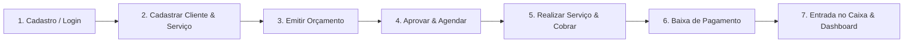
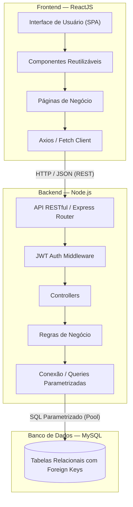

# MEI — Gestão Simplificada para Microempreendedores Individuais

> **Projeto Final • Formação Recode Pro AI**  
> **Proposta em uma frase:** Centralizar clientes, agenda, caixa, orçamentos e cobranças em uma única aplicação web simples, organizada e acessível para o Microempreendedor Individual (MEI).

---

## 📌 Sumário
- [1. Visão Geral do Projeto](#1-visão-geral-do-projeto)
- [2. O Problema e a Oportunidade](#2-o-problema-e-a-oportunidade)
- [3. Alinhamento com os ODS (ONU)](#3-alinhamento-com-os-ods-onu)
- [4. Público-Alvo e Personas](#4-público-alvo-e-personas)
- [5. Jornada Principal do Usuário](#5-jornada-principal-do-usuário)
- [6. Requisitos do Sistema](#6-requisitos-do-sistema)
- [7. Arquitetura da Solução](#7-arquitetura-da-solução)
- [8. Estrutura do Repositório](#8-estrutura-do-repositório)
- [9. Modelo de Dados Resumido](#9-modelo-de-dados-resumido)
- [10. API RESTful](#10-api-restful)
- [11. MVP e Fases de Entrega](#11-mvp-e-fases-de-entrega)
- [12. Critérios de Aceite](#12-critérios-de-aceite)
- [13. Roteiro Sugerido para Apresentação](#13-roteiro-sugerido-para-apresentação)
- [14. Evoluções Futuras](#14-evoluções-futuras)
- [15. Documentação Complementar](#15-documentação-complementar)
- [16. Banco Vetorial RAG com ChromaDB (Regras Oficiais do MEI)](#16-banco-vetorial-rag-com-chromadb-regras-oficiais-do-mei)
- [17. Grafo de Conhecimento e Dependências (Graphify)](#17-grafo-de-conhecimento-e-dependências-graphify)

---

## 1. Visão Geral do Projeto

O **MEI** é uma aplicação web completa desenvolvida para solucionar a desorganização enfrentada por Microempreendedores Individuais no cotidiano. Frequentemente, esses profissionais gerenciam seu negócio por meio de cadernos de anotações, mensagens soltas no WhatsApp e planilhas desconectadas.

A aplicação unifica em uma só plataforma:
1. **Cadastro e Gestão de Clientes**
2. **Catálogo de Serviços e Produtos**
3. **Agenda Inteligente de Compromissos**
4. **Criação e Gestão de Orçamentos Comerciais**
5. **Acompanhamento de Cobranças e Status de Pagamento**
6. **Controle de Caixa (Entradas e Saídas)**
7. **Dashboard Analítico** com indicadores essenciais de saúde do negócio.

### Objetivo Central
Reduzir o atrito e a complexidade na gestão do pequeno negócio, transformando etapas fragmentadas em um **fluxo integrado e fluido**:
$$\text{Cliente} \longrightarrow \text{Orçamento} \longrightarrow \text{Agendamento} \longrightarrow \text{Cobrança} \longrightarrow \text{Pagamento} \longrightarrow \text{Caixa}$$

---

## 2. O Problema e a Oportunidade

### 2.1 A Dor Principal
Microempreendedores acumulam múltiplas funções: atendimento, execução técnica do serviço, compra de materiais, prospecção e controle financeiro. A dispersão das informações resulta em:
- Esquecimento de horários e conflitos de agenda;
- Perda de histórico de atendimentos e preferências dos clientes;
- Inadimplência não monitorada (cobranças esquecidas ou atrasadas);
- Falta de visibilidade real sobre lucro, faturamento e despesas operacionais;
- Desperdício crônico de horas semanais em conferências manuais.

### 2.2 A Oportunidade
Construir uma solução web enxuta, de alta usabilidade, com linguagem direta e adaptada à realidade do MEI brasileiro, permitindo executar as operações chave em poucos cliques, sem excesso de burocracia ou termos contábeis complexos.

---

## 3. Alinhamento com os ODS (ONU)

O projeto está diretamente ancorado nos **Objetivos de Desenvolvimento Sustentável** da Agenda 2030:

* **ODS 8 — Trabalho Decente e Crescimento Econômico (Principal):**  
  Promove a modernização, formalização e sustentabilidade econômica dos microempreendedores, reduzindo a taxa de mortalidade precoce de pequenos negócios através de ferramentas eficazes de controle e gestão.
* **ODS 1 — Erradicação da Pobreza (Complementar):**  
  Para milhões de famílias, a atividade MEI representa a fonte principal de sustento e superação da vulnerabilidade social. Viabilizar um controle financeiro eficiente protege a renda gerada.

---

## 4. Público-Alvo e Personas

O sistema atende profissionais autônomos, prestadores de serviço e pequenos comerciantes:

| Persona | Perfil | Necessidade Central | Módulos Mais Utilizados |
| :--- | :--- | :--- | :--- |
| **MEI de Serviços** | Eletricista, manicure, diarista, mecânico, designer | Organizar horários, evitar furos e controlar recebimentos | Agenda + Clientes + Cobranças |
| **MEI Comercial** | Artesão, vendedor de cosméticos, confeiteiro | Controlar catálogo de produtos, vendas e caixa | Serviços/Produtos + Caixa + Cobranças |
| **MEI Híbrido** | Montador com peças próprias, salão com produtos | Centralizar operação comercial e técnica | Todos os módulos integrados |

---

## 5. Jornada Principal do Usuário



1. **Acesso:** O MEI cria sua conta ou realiza login seguro na plataforma.
2. **Base Cadastral:** Registra os clientes atendidos e o catálogo de serviços/produtos com valores base.
3. **Negociação:** Elabora uma proposta/orçamento detalhando itens, quantidades e descontos.
4. **Operação:** Com o orçamento aprovado, converte a demanda em um compromisso na agenda.
5. **Cobrança:** Gera o título de cobrança com data de vencimento vinculada ao cliente.
6. **Recebimento:** Ao receber o pagamento, dá baixa na cobrança (`status = PAGO`).
7. **Consolidação:** O sistema alimenta automaticamente o Caixa e atualiza os indicadores do Dashboard.

---

## 6. Requisitos do Sistema

### 6.1 Requisitos Funcionais (RF)

| ID | Módulo | Requisito | Prioridade |
| :--- | :--- | :--- | :--- |
| **RF01** | Clientes | Cadastrar, consultar, editar e excluir (inativar) clientes. | Alta |
| **RF02** | Serviços/Produtos | Cadastrar, consultar, editar e excluir itens do catálogo com preços. | Alta |
| **RF03** | Agenda | Criar, listar, reagendar, editar e cancelar compromissos com validação de choque de horários. | Alta |
| **RF04** | Orçamentos | Criar propostas comerciais com itens dinâmicos, cálculo automático de total e controle de status. | Alta |
| **RF05** | Cobranças | Emitir e listar cobranças com datas de vencimento, valores e baixa de recebimento. | Alta |
| **RF06** | Caixa | Registrar entradas e saídas financeiras, consultar extrato e filtrar por período. | Alta |
| **RF07** | Dashboard | Exibir cards com faturamento, pendências, agendamentos do dia e saldo acumulado. | Média |
| **RF08** | Autenticação | Controle de autenticação seguro (JWT), garantindo isolamento total dos dados de cada MEI. | Alta |

### 6.2 Requisitos Não Funcionais (RNF)

- **Usabilidade:** Interface intuitiva, responsiva (mobile-friendly), clara e com feedback visual imediato (toasts, loadings, estados vazios).
- **Manutenibilidade:** Código modularizado em React (componentização por domínio e reutilizáveis) e arquitetura em camadas no Node.js (Controllers, Services/Repositories, Routes, Middlewares).
- **Integridade dos Dados:** Restrições de integridade referencial com Foreign Keys no MySQL, impedindo dados órfãos e priorizando arquivamento/deleção lógica para entidades com histórico transacional.
- **Segurança:** Senhas criptografadas com `bcrypt`, autenticação baseada em JWT (JSON Web Tokens), validação de payloads nas duas pontas e queries parametrizadas prevenindo SQL Injection.
- **Desempenho:** Respostas de API em milissegundos para operações CRUD comuns do pequeno negócio.

---

## 7. Arquitetura da Solução



### Tecnologias Obrigatórias:
- **Frontend:** ReactJS (com React Router DOM, componentes modulares, CSS/Tailwind)
- **Backend:** Node.js (com Express, CORS, dotenv, jsonwebtoken, bcryptjs, mysql2)
- **Banco de Dados:** MySQL 8.x relacional

---

## 8. Estrutura do Repositório (Planejada)

A estrutura do projeto seguirá a separação entre backend e frontend mantendo a documentação na raiz:

```text
projeto-final-arandue/
├── README.md                      # Documentação principal do projeto
├── plan.md                        # Plano mestre de implementação passo a passo
├── Documentacao_Projeto_MEI.docx   # Documento de especificação original
├── docs/                          # Especificações técnicas aprofundadas
│   ├── modelo-dados.md            # Esquema completo do MySQL e DDL
│   ├── api.md                     # Contratos de endpoints da API REST
│   └── regras-negocio.md          # Lógica de negócio, fluxos e validações
├── backend/                       # Servidor Node.js + Express API
│   ├── src/
│   │   ├── config/                # Conexão com MySQL e variáveis de ambiente
│   │   ├── controllers/           # Manipuladores de requisição HTTP
│   │   ├── middlewares/           # Autenticação JWT e validações
│   │   ├── models/ / repositories/# Acesso e consultas SQL parametrizadas
│   │   ├── routes/                # Definição das rotas REST
│   │   ├── services/              # Regras de negócio e cálculos
│   │   └── server.js              # Inicialização da aplicação
│   ├── package.json
│   └── .env.example
└── frontend/                      # Aplicação ReactJS
    ├── src/
    │   ├── assets/                # Imagens, ícones e estilos globais
    │   ├── components/            # Componentes reutilizáveis (Navbar, Modal, DataTable...)
    │   ├── context/ / hooks/      # Estado global (AuthContext, tema, etc.)
    │   ├── pages/                 # Telas da aplicação (Dashboard, Clientes, Agenda...)
    │   ├── services/              # Integração HTTP com a API (api.js)
    │   ├── App.jsx                # Roteamento e layout base
    │   └── main.jsx               # Ponto de entrada do React
    ├── package.json
    └── .env.example
```

---

## 9. Modelo de Dados Resumido

| Tabela | Finalidade | Campos-Chave | Relacionamentos |
| :--- | :--- | :--- | :--- |
| `usuarios` | Contas e credenciais dos MEIs | `id, nome, email, senha, criado_em` | 1:N com `clientes`, `servicos`, `movimentacoes` |
| `clientes` | Clientes cadastrados pelo MEI | `id, usuario_id, nome, telefone, email, ativo` | N:1 com `usuarios`; 1:N com `orcamentos`, `agendamentos`, `cobrancas` |
| `servicos` | Catálogo de serviços e produtos | `id, usuario_id, nome, descricao, preco, ativo` | N:1 com `usuarios`; referenciado em itens de orçamentos e agendamentos |
| `agendamentos` | Compromissos e atendimentos | `id, usuario_id, cliente_id, servico_id, data_hora, status, observacoes` | N:1 com `usuarios`, `clientes` e `servicos` |
| `orcamentos` | Propostas comerciais emitidas | `id, usuario_id, cliente_id, data_emissao, validade, status, total, desconto` | N:1 com `usuarios` e `clientes`; 1:N com `orcamento_itens` |
| `orcamento_itens` | Detalhamento dos itens do orçamento | `id, orcamento_id, servico_id, quantidade, preco_unitario, subtotal` | N:1 com `orcamentos` e `servicos` |
| `cobrancas` | Títulos a receber | `id, usuario_id, cliente_id, orcamento_id, valor, vencimento, status, data_pagamento` | N:1 com `usuarios`, `clientes` e opcionalmente `orcamentos` |
| `movimentacoes` | Livro caixa (entradas e saídas) | `id, usuario_id, cobranca_id, tipo, categoria, valor, data_movimentacao, descricao` | N:1 com `usuarios` e opcionalmente `cobrancas` |

> *Para a especificação completa de tipos, constraints, chaves estrangeiras e índices, consulte [`docs/modelo-dados.md`](file:///home/JoaoVictor/projetos/projeto-final-arandue/docs/modelo-dados.md).*

---

## 10. API RESTful

A API segue os padrões RESTful com respostas em formato JSON e códigos de status HTTP semânticos (200, 201, 400, 401, 403, 404, 500).

- `POST /api/auth/register` & `POST /api/auth/login` — Gestão de acesso do MEI
- `/api/clientes` — CRUD de clientes do MEI
- `/api/servicos` — CRUD do catálogo de serviços e produtos
- `/api/agendamentos` — CRUD e controle de conflito de agenda
- `/api/orcamentos` — Gestão de orçamentos e itens com cálculo de total
- `/api/cobrancas` — Gestão de cobranças e baixa de recebimento
- `/api/movimentacoes` — Registro e extrato de entradas/saídas do caixa
- `/api/dashboard` — Métricas consolidadas (receita, despesas, agendamentos, pendências)

> *Para o detalhamento de rotas, parâmetros, exemplos de payload e respostas, consulte [`docs/api.md`](file:///home/JoaoVictor/projetos/projeto-final-arandue/docs/api.md).*

---

## 11. MVP e Fases de Entrega

O plano de entrega incremental garante que cada fase construa uma fundação sólida para a próxima:

```mermaid
gantt
    title Fases do MVP
    dateFormat  X
    axisFormat  Fase %d
    section Entrega
    Fase 1 - Base (Setup, Conexão, Auth)           :active, 0, 1
    Fase 2 - Cadastros (Clientes e Serviços)       :1, 2
    Fase 3 - Operação (Agenda e Orçamentos)        :2, 3
    Fase 4 - Financeiro (Cobranças e Caixa)        :3, 4
    Fase 5 - Dashboard & Refinamentos              :4, 5
```



- **Fase 1 — Base:** Configuração de ambiente, migrations do MySQL, pool de conexão e autenticação com JWT e bcrypt.
- **Fase 2 — Cadastros:** Telas e endpoints de CRUD completo para Clientes e Serviços com validações.
- **Fase 3 — Operação:** Módulos de Orçamentos (com cálculo no backend) e Agenda (com prevenção de conflitos de horário).
- **Fase 4 — Financeiro:** Módulos de Cobranças e Livro Caixa, com baixa automática de cobrança gerando entrada no caixa.
- **Fase 5 — Dashboard & Refinamentos:** Indicadores agregados no backend, componentes de métricas no frontend e validação de responsividade.

---

## 12. Critérios de Aceite

1. **CRUD Completo:** Todos os módulos previstos (Clientes, Serviços, Agenda, Orçamentos, Cobranças, Caixa) contam com criação, listagem, edição e exclusão/inativação funcionais.
2. **Integração Real:** Todas as operações da interface React persistem e recuperam dados do MySQL através da API Node.js.
3. **Integridade Relacional:** Dados vinculados mantêm integridade sem criar registros órfãos.
4. **Isolamento de Dados:** Cada usuário MEI acessa estritamente os seus próprios dados em qualquer endpoint.
5. **Experiência de Uso:** A interface exibe estados visuais claros de carregamento (*spinners/skeletons*), mensagens de sucesso e tratamento de erros.
6. **Fluxo de Ponta a Ponta:** É possível cadastrar um cliente, emitir um orçamento, agendar o atendimento, gerar cobrança, registrar pagamento e ver o impacto imediato no caixa e no dashboard sem tocar no banco de dados.

---

## 13. Roteiro Sugerido para Apresentação

Para apresentações e bancas avaliadoras da formação:
1. **Contexto & Problema:** Expor as dores do MEI que trabalha sozinho com controles manuais e desorganizados.
2. **Impacto Social & ODS:** Explicar a relação direta com o ODS 8 (Trabalho Decente e Crescimento Econômico) e ODS 1.
3. **Visão Geral (Dashboard):** Logar no sistema e mostrar os indicadores iniciais.
4. **Cadastros Base:** Cadastrar rapidamente um novo cliente e um novo serviço do catálogo.
5. **Orçamento Automatizado:** Criar uma proposta com múltiplos itens e demonstrar o cálculo automático do valor final.
6. **Agendamento Operacional:** Converter o atendimento em um compromisso na agenda.
7. **Cobrança & Baixa Financeira:** Gerar a cobrança do cliente e simular o recebimento marcando como "Pago".
8. **Caixa & Atualização em Tempo Real:** Demonstrar a entrada refletida no fluxo de caixa e o novo saldo no Dashboard.
9. **Fechamento Técnico:** Destacar a arquitetura limpa (React + Node.js + MySQL), tratamento de integridade e segurança.

---

## 14. Evoluções Futuras

- Exportação de orçamentos e recibos em formato PDF;
- Compartilhamento de orçamentos e cobranças via link seguro e WhatsApp;
- Disparo de notificações e lembretes de agenda/cobrança (WhatsApp / E-mail);
- Relatórios gerenciais avançados de Demonstração de Resultado do Exercício (DRE simplificado);
- Integração com gateways de pagamento (Pix automático, cartão de crédito);
- Assistente com Inteligência Artificial para sugestão de precificação, descrições de serviços e mensagens comerciais.

---

## 15. Documentação Complementar

- 📋 [Plano de Implementação Passo a Passo (plan.md)](file:///home/JoaoVictor/projetos/projeto-final-arandue/plan.md)
- 🗄️ [Especificação do Modelo de Dados MySQL (docs/modelo-dados.md)](file:///home/JoaoVictor/projetos/projeto-final-arandue/docs/modelo-dados.md)
- 🔌 [Especificação da API RESTful (docs/api.md)](file:///home/JoaoVictor/projetos/projeto-final-arandue/docs/api.md)
- ⚙️ [Regras de Negócio e Políticas do Sistema (docs/regras-negocio.md)](file:///home/JoaoVictor/projetos/projeto-final-arandue/docs/regras-negocio.md)

---

## 16. Assistente IA com RAG Oficial e MCP Multi-Tenancy

O sistema conta com um **Assistente Virtual com Inteligência Artificial** que orienta o MEI sobre regras tributárias/legais e consulta informações do seu próprio negócio em tempo real.

### 16.1 Arquitetura da Solução de IA
- **Microserviço Python FastAPI (`ai-service/` na porta 8001):** Orquestra o LLM (`gemini-3.5-flash-lite`), o RAG semântico e as chamadas a tools do MCP.
- **Embeddings:** `intfloat/multilingual-e5-small` (384 dimensões com normalização L2 e prefixos estritos `query: ` / `passage: `).
- **Armazenamento Vetorial Híbrido:**
  - *Desenvolvimento:* ChromaDB persistente em `data/chroma_db` (coleção `regras_mei_e5`).
  - *Produção:* Google Cloud Firestore Vector Search remoto com fallback transparente para ChromaDB via `FallbackRetriever` e circuit breaker.
- **Model Context Protocol (MCP) Multi-Tenant:** Cada MEI autenticado executa em um subprocesso Python dedicado e restrito sob o pool `TenantMcpPool`, recebendo um scoped token JWT efêmero (`scope: 'assistente:read'`) sem expor identificadores nas ferramentas e blindado contra prompt injection e vazamento de dados entre empresas.
- **Interface Web:** Aba `/assistente` no React com histórico de conversas, badges de páginas citadas do documento oficial (`docs/perguntaomei.pdf`) e aviso legal obrigatório.

### 16.2 Comandos Úteis do Microserviço de IA:
```bash
# Iniciar o microserviço FastAPI em desenvolvimento
npm run dev:ai

# Executar a suíte de testes do microserviço Python (pytest)
npm run test:ai

# Reindexar o corpus oficial do MEI com e5-small
.venv/bin/python ai-service/scripts/index_corpus.py

# Consultar o banco vetorial semântico via terminal
.venv/bin/python scripts/rag/query_mei.py "qual o limite de faturamento anual do MEI?"
```


---

## 17. Grafo de Conhecimento e Dependências (Graphify)

> [!IMPORTANT]
> **DIRETRIZ OBRIGATÓRIA DE DESENVOLVIMENTO:**  
> Sempre utilize o **Graphify** para visualizar, navegar e validar as dependências e o impacto cruzado no projeto antes de criar ou refatorar componentes, modelos do banco ou rotas de API.

O Graphify mapeia os relacionamentos determinísticos (*AST extraction*) e semânticos entre o frontend React, o backend Node.js, os modelos MySQL, os módulos de teste e a legislação do MEI.

### Visualização e Exploração:
- 🌐 **Grafo Interativo em HTML:** Abra o arquivo [`graphify-out/graph.html`](file:///home/JoaoVictor/projetos/projeto-final-arandue/graphify-out/graph.html) diretamente em qualquer navegador para inspecionar nós, clusters comunitários e fluxos visuais.
- 📊 **Relatório de Auditoria:** [`graphify-out/GRAPH_REPORT.md`](file:///home/JoaoVictor/projetos/projeto-final-arandue/graphify-out/GRAPH_REPORT.md) contendo os *God Nodes*, conexões surpreendentes e métricas de coesão.
- 💾 **Dados Brutos do Grafo:** [`graphify-out/graph.json`](file:///home/JoaoVictor/projetos/projeto-final-arandue/graphify-out/graph.json).

### Comandos Úteis do Graphify:
```bash
# Consultar relacionamentos e caminhos no grafo
.venv/bin/graphify query "Como as cobrancas se conectam ao caixa?"
.venv/bin/graphify query "Quais tabelas dependem de usuarios?"

# Atualizar o grafo após criar ou alterar arquivos no projeto
.venv/bin/graphify update
```

