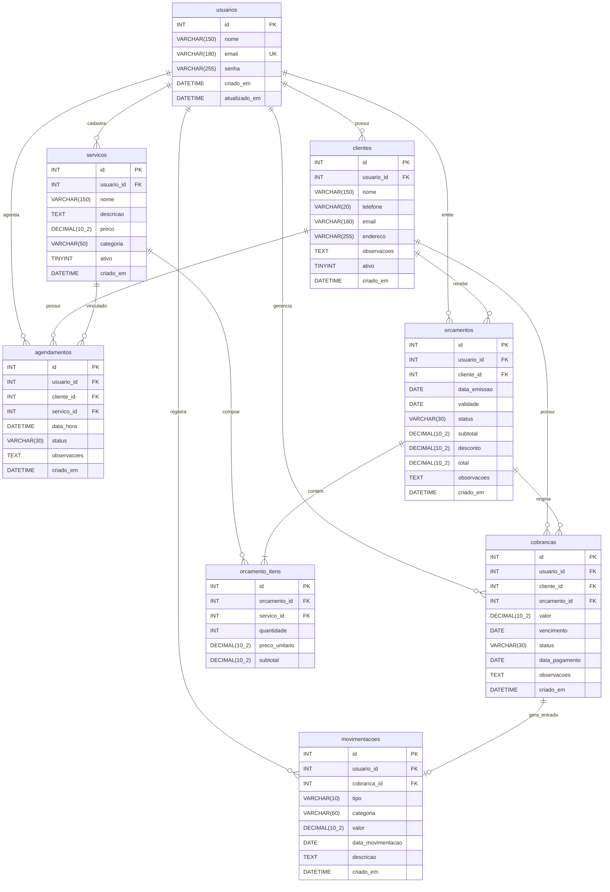

# Modelo de Dados — Banco de Dados MySQL

Este documento especifica a arquitetura relacional, diagramas entidade-relacionamento (ER), dicionário de dados e regras de integridade referencial para o banco de dados MySQL da aplicação **MEI — Gestão Simplificada**.

---

## 1. Diagrama Entidade-Relacionamento (ER)



---

## 2. Dicionário de Dados Detalhado

### 2.1 Tabela `usuarios`
Armazena os dados cadastrais e as credenciais de login do Microempreendedor Individual.
- Cada usuário MEI é isolado logicamente em uma estratégia multi-tenant leve por coluna (`usuario_id`).

| Campo | Tipo | Nulo | Padrão | Descrição |
| :--- | :--- | :--- | :--- | :--- |
| `id` | `INT AUTO_INCREMENT` | Não | — | Chave primária |
| `nome` | `VARCHAR(150)` | Não | — | Nome completo ou razão social do MEI |
| `email` | `VARCHAR(180)` | Não | — | E-mail corporativo (Único / Login) |
| `senha` | `VARCHAR(255)` | Não | — | Hash criptográfico da senha (`bcrypt`) |
| `criado_em` | `DATETIME` | Não | `CURRENT_TIMESTAMP` | Data/hora de cadastro |
| `atualizado_em` | `DATETIME` | Sim | `NULL ON UPDATE CURRENT_TIMESTAMP` | Data/hora da última atualização |

---

### 2.2 Tabela `clientes`
Armazena a base de clientes atendidos pelo MEI.

| Campo | Tipo | Nulo | Padrão | Descrição |
| :--- | :--- | :--- | :--- | :--- |
| `id` | `INT AUTO_INCREMENT` | Não | — | Chave primária |
| `usuario_id` | `INT` | Não | — | Chave estrangeira -> `usuarios(id)` |
| `nome` | `VARCHAR(150)` | Não | — | Nome do cliente |
| `telefone` | `VARCHAR(20)` | Sim | `NULL` | Telefone / WhatsApp do cliente |
| `email` | `VARCHAR(180)` | Sim | `NULL` | E-mail para envio de orçamentos e contato |
| `endereco` | `VARCHAR(255)` | Sim | `NULL` | Endereço para atendimentos externos |
| `observacoes` | `TEXT` | Sim | `NULL` | Notas específicas sobre o cliente |
| `ativo` | `TINYINT(1)` | Não | `1` | `1` = Ativo, `0` = Inativo / Arquivado |
| `criado_em` | `DATETIME` | Não | `CURRENT_TIMESTAMP` | Data de criação |

---

### 2.3 Tabela `servicos`
Armazena o catálogo de serviços prestados e produtos comercializados pelo MEI.

| Campo | Tipo | Nulo | Padrão | Descrição |
| :--- | :--- | :--- | :--- | :--- |
| `id` | `INT AUTO_INCREMENT` | Não | — | Chave primária |
| `usuario_id` | `INT` | Não | — | Chave estrangeira -> `usuarios(id)` |
| `nome` | `VARCHAR(150)` | Não | — | Nome do serviço ou produto |
| `descricao` | `TEXT` | Sim | `NULL` | Detalhes técnicos ou especificações |
| `preco` | `DECIMAL(10,2)` | Não | `0.00` | Preço padrão tabelado |
| `categoria` | `VARCHAR(50)` | Sim | `'Geral'` | Categoria (ex: 'Serviço', 'Produto', 'Manutenção') |
| `ativo` | `TINYINT(1)` | Não | `1` | `1` = Ativo, `0` = Inativo / Descontinuado |
| `criado_em` | `DATETIME` | Não | `CURRENT_TIMESTAMP` | Data de inclusão |

---

### 2.4 Tabela `agendamentos`
Armazena os compromissos de atendimento marcados pelo MEI com seus clientes.

| Campo | Tipo | Nulo | Padrão | Descrição |
| :--- | :--- | :--- | :--- | :--- |
| `id` | `INT AUTO_INCREMENT` | Não | — | Chave primária |
| `usuario_id` | `INT` | Não | — | Chave estrangeira -> `usuarios(id)` |
| `cliente_id` | `INT` | Não | — | Chave estrangeira -> `clientes(id)` |
| `servico_id` | `INT` | Sim | `NULL` | Chave estrangeira -> `servicos(id)` (opcional) |
| `data_hora` | `DATETIME` | Não | — | Data e hora agendada do atendimento |
| `status` | `VARCHAR(30)` | Não | `'PENDENTE'` | `'PENDENTE'`, `'CONFIRMADO'`, `'CONCLUIDO'`, `'CANCELADO'` |
| `observacoes` | `TEXT` | Sim | `NULL` | Instruções ou lembretes |
| `criado_em` | `DATETIME` | Não | `CURRENT_TIMESTAMP` | Data de agendamento |

---

### 2.5 Tabela `orcamentos`
Armazena as propostas comerciais geradas para os clientes.

| Campo | Tipo | Nulo | Padrão | Descrição |
| :--- | :--- | :--- | :--- | :--- |
| `id` | `INT AUTO_INCREMENT` | Não | — | Chave primária |
| `usuario_id` | `INT` | Não | — | Chave estrangeira -> `usuarios(id)` |
| `cliente_id` | `INT` | Não | — | Chave estrangeira -> `clientes(id)` |
| `data_emissao` | `DATE` | Não | `(CURRENT_DATE)` | Data em que a proposta foi gerada |
| `validade` | `DATE` | Sim | `NULL` | Data de validade da proposta |
| `status` | `VARCHAR(30)` | Não | `'RASCUNHO'` | `'RASCUNHO'`, `'ENVIADO'`, `'APROVADO'`, `'RECUSADO'` |
| `subtotal` | `DECIMAL(10,2)` | Não | `0.00` | Soma dos itens (`quantidade * preco_unitario`) |
| `desconto` | `DECIMAL(10,2)` | Não | `0.00` | Valor monetário de desconto |
| `total` | `DECIMAL(10,2)` | Não | `0.00` | Valor final (`subtotal - desconto`), validado no backend |
| `observacoes` | `TEXT` | Sim | `NULL` | Condições comerciais, garantia, etc. |
| `criado_em` | `DATETIME` | Não | `CURRENT_TIMESTAMP` | Data de registro |

---

### 2.6 Tabela `orcamento_itens`
Armazena cada serviço ou produto que compõe um orçamento.

| Campo | Tipo | Nulo | Padrão | Descrição |
| :--- | :--- | :--- | :--- | :--- |
| `id` | `INT AUTO_INCREMENT` | Não | — | Chave primária |
| `orcamento_id` | `INT` | Não | — | Chave estrangeira -> `orcamentos(id)` (CASCADE na exclusão do orçamento) |
| `servico_id` | `INT` | Sim | `NULL` | Chave estrangeira -> `servicos(id)` (SET NULL para histórico) |
| `quantidade` | `INT` | Não | `1` | Quantidade contratada (mínimo 1) |
| `preco_unitario`| `DECIMAL(10,2)` | Não | `0.00` | Preço praticado no momento da proposta |
| `subtotal` | `DECIMAL(10,2)` | Não | `0.00` | `quantidade * preco_unitario` |

---

### 2.7 Tabela `cobrancas`
Armazena os valores que o MEI precisa receber (títulos ou faturas).

| Campo | Tipo | Nulo | Padrão | Descrição |
| :--- | :--- | :--- | :--- | :--- |
| `id` | `INT AUTO_INCREMENT` | Não | — | Chave primária |
| `usuario_id` | `INT` | Não | — | Chave estrangeira -> `usuarios(id)` |
| `cliente_id` | `INT` | Não | — | Chave estrangeira -> `clientes(id)` |
| `orcamento_id` | `INT` | Sim | `NULL` | Chave estrangeira -> `orcamentos(id)` (origem opcional) |
| `valor` | `DECIMAL(10,2)` | Não | — | Valor a receber (positivo) |
| `vencimento` | `DATE` | Não | — | Data limite para pagamento |
| `status` | `VARCHAR(30)` | Não | `'PENDENTE'` | `'PENDENTE'`, `'PAGO'`, `'CANCELADO'`, `'ATRASADO'` |
| `data_pagamento`| `DATE` | Sim | `NULL` | Data em que a baixa de pagamento ocorreu |
| `observacoes` | `TEXT` | Sim | `NULL` | Forma acordada (Pix, dinheiro, etc.) |
| `criado_em` | `DATETIME` | Não | `CURRENT_TIMESTAMP` | Data de emissão |

---

### 2.8 Tabela `movimentacoes`
Representa o Livro Caixa do negócio, registrando todas as entradas e saídas de capital.

| Campo | Tipo | Nulo | Padrão | Descrição |
| :--- | :--- | :--- | :--- | :--- |
| `id` | `INT AUTO_INCREMENT` | Não | — | Chave primária |
| `usuario_id` | `INT` | Não | — | Chave estrangeira -> `usuarios(id)` |
| `cobranca_id` | `INT` | Sim | `NULL` | Chave estrangeira -> `cobrancas(id)` (se gerada por baixa) |
| `tipo` | `VARCHAR(10)` | Não | — | `'ENTRADA'` ou `'SAIDA'` |
| `categoria` | `VARCHAR(60)` | Não | `'Geral'` | Ex: `'Serviço'`, `'Material'`, `'Transporte'`, `'Alimentação'` |
| `valor` | `DECIMAL(10,2)` | Não | — | Valor monetário (sempre positivo; o tipo define o sinal) |
| `data_movimentacao` | `DATE` | Não | — | Data em que o dinheiro entrou ou saiu |
| `descricao` | `TEXT` | Não | — | Descrição textual da movimentação |
| `criado_em` | `DATETIME` | Não | `CURRENT_TIMESTAMP` | Data de inclusão |

---

---

## 3. Matriz de Integridade Referencial, Restrições e Soft Delete

### 3.1 Regras de Primary Key (PK)
- **Padrão Adotado:** Todas as tabelas utilizam `id INT AUTO_INCREMENT PRIMARY KEY`.
- **Justificativa Técnica:** Garante chaves primárias numéricas sequenciais, compactas (4 bytes) e indexadas como *Clustered Index* padrão na engine InnoDB, otimizando a árvore B+Tree de busca e facilitando as operações de junção (*JOIN*).

---

### 3.2 Regras de Foreign Key (FK) e Relacionamentos
- `clientes.usuario_id` $\longrightarrow$ `usuarios(id)`
- `servicos.usuario_id` $\longrightarrow$ `usuarios(id)`
- `agendamentos.usuario_id` $\longrightarrow$ `usuarios(id)`
- `agendamentos.cliente_id` $\longrightarrow$ `clientes(id)`
- `agendamentos.servico_id` $\longrightarrow$ `servicos(id)`
- `orcamentos.usuario_id` $\longrightarrow$ `usuarios(id)`
- `orcamentos.cliente_id` $\longrightarrow$ `clientes(id)`
- `orcamento_itens.orcamento_id` $\longrightarrow$ `orcamentos(id)`
- `orcamento_itens.servico_id` $\longrightarrow$ `servicos(id)`
- `cobrancas.usuario_id` $\longrightarrow$ `usuarios(id)`
- `cobrancas.cliente_id` $\longrightarrow$ `clientes(id)`
- `cobrancas.orcamento_id` $\longrightarrow$ `orcamentos(id)`
- `movimentacoes.usuario_id` $\longrightarrow$ `usuarios(id)`
- `movimentacoes.cobranca_id` $\longrightarrow$ `cobrancas(id)`

---

### 3.3 Regras de UNIQUE
1. **`usuarios.email`:** `UNIQUE KEY uk_usuarios_email (email)` — Impede duplicação de contas e garante unicidade de login.
2. **`agendamentos.(usuario_id, data_hora)`:** `UNIQUE KEY uk_agendamentos_horario (usuario_id, data_hora)` — **Bloqueio anti-choque de horário no nível do banco**, impedindo que um MEI cadastre dois atendimentos no mesmo instante exato.

---

### 3.4 Regras de INDEX (Otimização de Consultas e Multi-Tenancy)
1. **Filtro Multi-Tenant Básico:**
   - `idx_clientes_usuario (usuario_id)`
   - `idx_servicos_usuario (usuario_id)`
   - `idx_orcamentos_usuario (usuario_id)`
2. **Índices Compostos de Negócio e Dashboard:**
   - `idx_agendamentos_usuario_data (usuario_id, data_hora)` — Filtros diários de agenda.
   - `idx_cobrancas_usuario_status_venc (usuario_id, status, vencimento)` — Cálculo imediato de cobranças pendentes e valores em atraso para o Dashboard.
   - `idx_movimentacoes_usuario_tipo_data (usuario_id, tipo, data_movimentacao)` — Agregação veloz de entradas, saídas e saldo do mês corrente no Livro Caixa.
   - `idx_orcamentos_usuario_status (usuario_id, status)` — Contagem de orçamentos pendentes de aprovação.

---

### 3.5 Regras de CHECK Constraints (MySQL 8.0+)
As seguintes validações de domínio são impostas no banco de dados para evitar estados inconsistentes mesmo em caso de erro na aplicação:
1. **`servicos`:** `CONSTRAINT chk_servicos_preco CHECK (preco >= 0.00)`
2. **`orcamentos`:**
   - `CONSTRAINT chk_orcamentos_subtotal CHECK (subtotal >= 0.00)`
   - `CONSTRAINT chk_orcamentos_desconto CHECK (desconto >= 0.00)`
   - `CONSTRAINT chk_orcamentos_total CHECK (total >= 0.00)`
   - `CONSTRAINT chk_orcamentos_status CHECK (status IN ('RASCUNHO', 'ENVIADO', 'APROVADO', 'RECUSADO', 'CANCELADO'))`
3. **`orcamento_itens`:**
   - `CONSTRAINT chk_orc_itens_qtd CHECK (quantidade >= 1)`
   - `CONSTRAINT chk_orc_itens_preco CHECK (preco_unitario >= 0.00)`
   - `CONSTRAINT chk_orc_itens_subtotal CHECK (subtotal >= 0.00)`
4. **`agendamentos`:**
   - `CONSTRAINT chk_agendamentos_status CHECK (status IN ('PENDENTE', 'CONFIRMADO', 'CONCLUIDO', 'CANCELADO'))`
5. **`cobrancas`:**
   - `CONSTRAINT chk_cobrancas_valor CHECK (valor > 0.00)`
   - `CONSTRAINT chk_cobrancas_status CHECK (status IN ('PENDENTE', 'PAGO', 'CANCELADO', 'ATRASADO'))`
6. **`movimentacoes`:**
   - `CONSTRAINT chk_movimentacoes_valor CHECK (valor > 0.00)`
   - `CONSTRAINT chk_movimentacoes_tipo CHECK (tipo IN ('ENTRADA', 'SAIDA'))`

---

### 3.6 Regras de ON DELETE
| Relação / Pai | Tabela Filha | Ação ON DELETE | Racional / Comportamento |
| :--- | :--- | :--- | :--- |
| `usuarios` excluído | Todas as filhas | `CASCADE` | Se o cadastro do MEI for excluído da plataforma, apaga todos os seus dados em cascata (LGPD). |
| `clientes` excluído | `agendamentos`, `orcamentos`, `cobrancas` | `RESTRICT` | **Proíbe exclusão física do cliente** se existirem agendamentos, orçamentos ou cobranças associadas, forçando o uso de Soft Delete. |
| `servicos` excluído | `agendamentos`, `orcamento_itens` | `SET NULL` | Se o item do catálogo for excluído, a linha do orçamento ou agendamento histórico mantém seus valores e o campo vira `NULL` (preserva histórico financeiro). |
| `orcamentos` excluído | `orcamento_itens` | `CASCADE` | Os itens pertencem exclusivamente ao orçamento pai. Excluir o orçamento remove seus itens. |
| `orcamentos` excluído | `cobrancas` | `SET NULL` | A cobrança já gerada permanece válida como título a receber mesmo se o rascunho do orçamento for removido. |
| `cobrancas` excluído | `movimentacoes` | `SET NULL` | O livro caixa é registro contábil e de auditoria: o registro de entrada financeira permanece preservado mesmo se a cobrança for desvinculada. |

---

### 3.7 Regras de ON UPDATE
- **Para Chaves Estrangeiras:** Todas as constraints utilizam `ON UPDATE CASCADE`, garantindo que qualquer eventual atualização de identificador pai seja refletida nas filhas sem quebras.
- **Para Auditoria Temporal:** Campos `atualizado_em` utilizam `DATETIME NULL ON UPDATE CURRENT_TIMESTAMP` em `usuarios`, `clientes` e `servicos`.

---

### 3.8 Política de SOFT DELETE (Onde e Como é Aplicado)

O Soft Delete é fundamental para a integridade contábil e fiscal de um sistema de gestão para MEI:

1. **`clientes` (Soft Delete Explícito por Flag e Data):**
   - **Campos:** `ativo TINYINT(1) NOT NULL DEFAULT 1`, `deletado_em DATETIME NULL`
   - **Regra:** Se o cliente possuir histórico comercial (orçamentos, cobranças), a aplicação altera `ativo = 0` e preenche `deletado_em = NOW()`.
   - **Efeito:** O cliente não aparece nas buscas de novos atendimentos, mas seus dados continuam visíveis em cobranças e relatórios históricos.
2. **`servicos` (Soft Delete por Inativação de Catálogo):**
   - **Campos:** `ativo TINYINT(1) NOT NULL DEFAULT 1`, `deletado_em DATETIME NULL`
   - **Regra:** Serviços/produtos descontinuados são inativados (`ativo = 0`). Não aparecem no seletor de novos orçamentos, mas propostas antigas não são afetadas.
3. **`orcamentos` (Soft Delete via Máquina de Estados):**
   - **Campo:** `status VARCHAR(30)`
   - **Regra:** Propostas enviadas ou aprovadas **não sofrem exclusão física**; em vez disso, são arquivadas como `status = 'RECUSADO'` ou `'CANCELADO'`. Apenas rascunhos sem vínculo podem ser expurgados.
4. **`agendamentos` (Soft Delete via Máquina de Estados):**
   - **Campo:** `status VARCHAR(30)`
   - **Regra:** Cancelamentos de reuniões/serviços recebem `status = 'CANCELADO'`, liberando o horário na agenda sem apagar o histórico de cancelamentos do cliente.
5. **`cobrancas` (Soft Delete via Máquina de Estados):**
   - **Campo:** `status VARCHAR(30)`
   - **Regra:** Títulos cancelados recebem `status = 'CANCELADO'`. Não há exclusão física de cobrança que já tenha sido registrada ou cobrada.
6. **`movimentacoes` (Livro Caixa — Imutabilidade Contábil):**
   - **Regra:** Por exigência fiscal (Resolução CGSN nº 140 e orientações do Simei em `perguntaomei.pdf`), **o livro caixa não sofre exclusão física nem lógica oculta**. Lançamentos errôneos devem ser retificados por meio de um **lançamento estornador/compensatório**, assegurando trilha de auditoria limpa.

---

## 4. DDL de Referência Completo e Atualizado (MySQL 8.x)

```sql
CREATE DATABASE IF NOT EXISTS mei_db CHARACTER SET utf8mb4 COLLATE utf8mb4_unicode_ci;
USE mei_db;

-- 1. Tabela de Usuários (MEIs)
CREATE TABLE IF NOT EXISTS usuarios (
    id INT AUTO_INCREMENT PRIMARY KEY,
    nome VARCHAR(150) NOT NULL,
    email VARCHAR(180) NOT NULL,
    senha VARCHAR(255) NOT NULL,
    criado_em DATETIME NOT NULL DEFAULT CURRENT_TIMESTAMP,
    atualizado_em DATETIME NULL ON UPDATE CURRENT_TIMESTAMP,
    CONSTRAINT uk_usuarios_email UNIQUE (email)
) ENGINE=InnoDB;

-- 2. Tabela de Clientes
CREATE TABLE IF NOT EXISTS clientes (
    id INT AUTO_INCREMENT PRIMARY KEY,
    usuario_id INT NOT NULL,
    nome VARCHAR(150) NOT NULL,
    telefone VARCHAR(20) NULL,
    email VARCHAR(180) NULL,
    endereco VARCHAR(255) NULL,
    observacoes TEXT NULL,
    ativo TINYINT(1) NOT NULL DEFAULT 1,
    criado_em DATETIME NOT NULL DEFAULT CURRENT_TIMESTAMP,
    atualizado_em DATETIME NULL ON UPDATE CURRENT_TIMESTAMP,
    deletado_em DATETIME NULL,
    CONSTRAINT fk_clientes_usuario FOREIGN KEY (usuario_id) 
        REFERENCES usuarios(id) ON DELETE CASCADE ON UPDATE CASCADE,
    INDEX idx_clientes_usuario (usuario_id),
    INDEX idx_clientes_ativo (usuario_id, ativo)
) ENGINE=InnoDB;

-- 3. Tabela de Serviços e Produtos
CREATE TABLE IF NOT EXISTS servicos (
    id INT AUTO_INCREMENT PRIMARY KEY,
    usuario_id INT NOT NULL,
    nome VARCHAR(150) NOT NULL,
    descricao TEXT NULL,
    preco DECIMAL(10,2) NOT NULL DEFAULT 0.00,
    categoria VARCHAR(50) DEFAULT 'Geral',
    ativo TINYINT(1) NOT NULL DEFAULT 1,
    criado_em DATETIME NOT NULL DEFAULT CURRENT_TIMESTAMP,
    atualizado_em DATETIME NULL ON UPDATE CURRENT_TIMESTAMP,
    deletado_em DATETIME NULL,
    CONSTRAINT fk_servicos_usuario FOREIGN KEY (usuario_id) 
        REFERENCES usuarios(id) ON DELETE CASCADE ON UPDATE CASCADE,
    CONSTRAINT chk_servicos_preco CHECK (preco >= 0.00),
    INDEX idx_servicos_usuario (usuario_id),
    INDEX idx_servicos_ativo (usuario_id, ativo)
) ENGINE=InnoDB;

-- 4. Tabela de Agendamentos
CREATE TABLE IF NOT EXISTS agendamentos (
    id INT AUTO_INCREMENT PRIMARY KEY,
    usuario_id INT NOT NULL,
    cliente_id INT NOT NULL,
    servico_id INT NULL,
    data_hora DATETIME NOT NULL,
    status VARCHAR(30) NOT NULL DEFAULT 'PENDENTE',
    observacoes TEXT NULL,
    criado_em DATETIME NOT NULL DEFAULT CURRENT_TIMESTAMP,
    atualizado_em DATETIME NULL ON UPDATE CURRENT_TIMESTAMP,
    CONSTRAINT fk_agendamentos_usuario FOREIGN KEY (usuario_id) 
        REFERENCES usuarios(id) ON DELETE CASCADE ON UPDATE CASCADE,
    CONSTRAINT fk_agendamentos_cliente FOREIGN KEY (cliente_id) 
        REFERENCES clientes(id) ON DELETE RESTRICT ON UPDATE CASCADE,
    CONSTRAINT fk_agendamentos_servico FOREIGN KEY (servico_id) 
        REFERENCES servicos(id) ON DELETE SET NULL ON UPDATE CASCADE,
    CONSTRAINT uk_agendamentos_horario UNIQUE (usuario_id, data_hora),
    CONSTRAINT chk_agendamentos_status CHECK (status IN ('PENDENTE', 'CONFIRMADO', 'CONCLUIDO', 'CANCELADO')),
    INDEX idx_agendamentos_usuario_data (usuario_id, data_hora)
) ENGINE=InnoDB;

-- 5. Tabela de Orçamentos
CREATE TABLE IF NOT EXISTS orcamentos (
    id INT AUTO_INCREMENT PRIMARY KEY,
    usuario_id INT NOT NULL,
    cliente_id INT NOT NULL,
    data_emissao DATE NOT NULL,
    validade DATE NULL,
    status VARCHAR(30) NOT NULL DEFAULT 'RASCUNHO',
    subtotal DECIMAL(10,2) NOT NULL DEFAULT 0.00,
    desconto DECIMAL(10,2) NOT NULL DEFAULT 0.00,
    total DECIMAL(10,2) NOT NULL DEFAULT 0.00,
    observacoes TEXT NULL,
    criado_em DATETIME NOT NULL DEFAULT CURRENT_TIMESTAMP,
    atualizado_em DATETIME NULL ON UPDATE CURRENT_TIMESTAMP,
    CONSTRAINT fk_orcamentos_usuario FOREIGN KEY (usuario_id) 
        REFERENCES usuarios(id) ON DELETE CASCADE ON UPDATE CASCADE,
    CONSTRAINT fk_orcamentos_cliente FOREIGN KEY (cliente_id) 
        REFERENCES clientes(id) ON DELETE RESTRICT ON UPDATE CASCADE,
    CONSTRAINT chk_orcamentos_subtotal CHECK (subtotal >= 0.00),
    CONSTRAINT chk_orcamentos_desconto CHECK (desconto >= 0.00),
    CONSTRAINT chk_orcamentos_total CHECK (total >= 0.00),
    CONSTRAINT chk_orcamentos_status CHECK (status IN ('RASCUNHO', 'ENVIADO', 'APROVADO', 'RECUSADO', 'CANCELADO')),
    INDEX idx_orcamentos_usuario (usuario_id),
    INDEX idx_orcamentos_usuario_status (usuario_id, status)
) ENGINE=InnoDB;

-- 6. Tabela de Itens do Orçamento
CREATE TABLE IF NOT EXISTS orcamento_itens (
    id INT AUTO_INCREMENT PRIMARY KEY,
    orcamento_id INT NOT NULL,
    servico_id INT NULL,
    quantidade INT NOT NULL DEFAULT 1,
    preco_unitario DECIMAL(10,2) NOT NULL DEFAULT 0.00,
    subtotal DECIMAL(10,2) NOT NULL DEFAULT 0.00,
    CONSTRAINT fk_orcamento_itens_orcamento FOREIGN KEY (orcamento_id) 
        REFERENCES orcamentos(id) ON DELETE CASCADE ON UPDATE CASCADE,
    CONSTRAINT fk_orcamento_itens_servico FOREIGN KEY (servico_id) 
        REFERENCES servicos(id) ON DELETE SET NULL ON UPDATE CASCADE,
    CONSTRAINT chk_orc_itens_qtd CHECK (quantidade >= 1),
    CONSTRAINT chk_orc_itens_preco CHECK (preco_unitario >= 0.00),
    CONSTRAINT chk_orc_itens_subtotal CHECK (subtotal >= 0.00),
    INDEX idx_orcamento_itens_orcamento (orcamento_id)
) ENGINE=InnoDB;

-- 7. Tabela de Cobranças
CREATE TABLE IF NOT EXISTS cobrancas (
    id INT AUTO_INCREMENT PRIMARY KEY,
    usuario_id INT NOT NULL,
    cliente_id INT NOT NULL,
    orcamento_id INT NULL,
    valor DECIMAL(10,2) NOT NULL,
    vencimento DATE NOT NULL,
    status VARCHAR(30) NOT NULL DEFAULT 'PENDENTE',
    data_pagamento DATE NULL,
    observacoes TEXT NULL,
    criado_em DATETIME NOT NULL DEFAULT CURRENT_TIMESTAMP,
    atualizado_em DATETIME NULL ON UPDATE CURRENT_TIMESTAMP,
    CONSTRAINT fk_cobrancas_usuario FOREIGN KEY (usuario_id) 
        REFERENCES usuarios(id) ON DELETE CASCADE ON UPDATE CASCADE,
    CONSTRAINT fk_cobrancas_cliente FOREIGN KEY (cliente_id) 
        REFERENCES clientes(id) ON DELETE RESTRICT ON UPDATE CASCADE,
    CONSTRAINT fk_cobrancas_orcamento FOREIGN KEY (orcamento_id) 
        REFERENCES orcamentos(id) ON DELETE SET NULL ON UPDATE CASCADE,
    CONSTRAINT chk_cobrancas_valor CHECK (valor > 0.00),
    CONSTRAINT chk_cobrancas_status CHECK (status IN ('PENDENTE', 'PAGO', 'CANCELADO', 'ATRASADO')),
    INDEX idx_cobrancas_usuario_venc (usuario_id, vencimento),
    INDEX idx_cobrancas_usuario_status_venc (usuario_id, status, vencimento)
) ENGINE=InnoDB;

-- 8. Tabela de Movimentações (Livro Caixa)
CREATE TABLE IF NOT EXISTS movimentacoes (
    id INT AUTO_INCREMENT PRIMARY KEY,
    usuario_id INT NOT NULL,
    cobranca_id INT NULL,
    tipo VARCHAR(10) NOT NULL,
    categoria VARCHAR(60) NOT NULL DEFAULT 'Geral',
    valor DECIMAL(10,2) NOT NULL,
    data_movimentacao DATE NOT NULL,
    descricao TEXT NOT NULL,
    criado_em DATETIME NOT NULL DEFAULT CURRENT_TIMESTAMP,
    CONSTRAINT fk_movimentacoes_usuario FOREIGN KEY (usuario_id) 
        REFERENCES usuarios(id) ON DELETE CASCADE ON UPDATE CASCADE,
    CONSTRAINT fk_movimentacoes_cobranca FOREIGN KEY (cobranca_id) 
        REFERENCES cobrancas(id) ON DELETE SET NULL ON UPDATE CASCADE,
    CONSTRAINT chk_movimentacoes_valor CHECK (valor > 0.00),
    CONSTRAINT chk_movimentacoes_tipo CHECK (tipo IN ('ENTRADA', 'SAIDA')),
    INDEX idx_movimentacoes_usuario_data (usuario_id, data_movimentacao),
    INDEX idx_movimentacoes_usuario_tipo_data (usuario_id, tipo, data_movimentacao)
) ENGINE=InnoDB;
```
```
