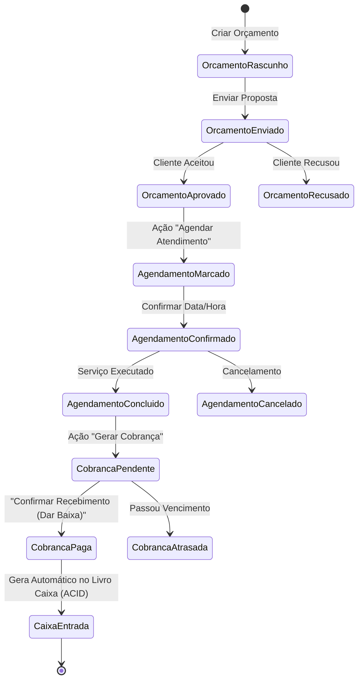

# Especificação de Design — Integração do Fluxo Ponta a Ponta: Orçamento ➔ Agendamento ➔ Cobrança ➔ Livro Caixa

**Data:** 02/10/2026  
**Status:** Aprovado  
**Tipo:** Arquitetural (Integração Transversal de Domínios)  
**Módulos Envolvidos:** Orçamentos, Agenda, Cobranças, Livro Caixa  

---

## 1. Visão Geral e Objetivo

Atualmente, os módulos do Aranduê funcionavam como silos independentes (era possível criar agendamentos soltos, emitir cobranças avulsas e lançar movimentações manuais de entrada). 

O objetivo desta especificação é implementar o **Fluxo Estrito / Fechado de Receitas**, onde toda entrada financeira de clientes decorre de uma esteira contábil e operacional auditável:

$$\text{Orçamento Aprovado} \longrightarrow \text{Agendamento Concluído} \longrightarrow \text{Cobrança Emitida} \longrightarrow \text{Liquidação no Livro Caixa}$$

---

## 2. Diagrama de Estados e Ciclo de Vida do Negócio



---

## 3. Modelo de Dados Relacional (MySQL InnoDB)

### 3.1. Tabela `agendamentos`
- **Nova Coluna:** `orcamento_id INT NOT NULL`
- **Chave Estrangeira:** 
  ```sql
  CONSTRAINT fk_agendamentos_orcamento FOREIGN KEY (orcamento_id) 
      REFERENCES orcamentos(id) ON DELETE RESTRICT ON UPDATE CASCADE
  ```
- **Índice:** `INDEX idx_agendamentos_orcamento (usuario_id, orcamento_id)`
- **Regra de Unicidade:** Cada orçamento aprovado gera no máximo 1 agendamento ativo (`UNIQUE (usuario_id, orcamento_id)` para status não-cancelados).

### 3.2. Tabela `cobrancas`
- **Coluna `orcamento_id`:** Torna-se `INT NOT NULL` com FK `fk_cobrancas_orcamento`.
- **Nova Coluna:** `agendamento_id INT NOT NULL`
- **Chave Estrangeira:**
  ```sql
  CONSTRAINT fk_cobrancas_agendamento FOREIGN KEY (agendamento_id) 
      REFERENCES agendamentos(id) ON DELETE RESTRICT ON UPDATE CASCADE
  ```
- **Índice:** `INDEX idx_cobrancas_agendamento (usuario_id, agendamento_id)`
- **Regra de Unicidade:** Cada agendamento concluído possui exatamente 1 cobrança ativa vinculada (`UNIQUE (usuario_id, agendamento_id)`).

### 3.3. Tabela `movimentacoes`
- Mantém `cobranca_id INT NULL` com FK `fk_movimentacoes_cobranca`.
- `tipo = 'ENTRADA'`: gerado estritamente a partir da baixa de uma cobrança (`cobranca_id NOT NULL`).
- `tipo = 'SAIDA'`: despesas operacionais do MEI continuam com lançamento manual (`cobranca_id NULL`).

---

## 4. Regras de Negócio e Serviços Backend

### 4.1. `orcamentoService.js`
- **Status do Orçamento:**
  - `RASCUNHO` / `ENVIADO`: não permite agendar atendimento.
  - `APROVADO`: habilita o agendamento.
  - `RECUSADO` / `CANCELADO`: encerra o ciclo.
- **Detalhamento (`obterPorId` / `listar`):**
  - Retorna o objeto estendido com informações das etapas subsequentes:
    ```json
    {
      "id": 1,
      "status": "APROVADO",
      "cliente_id": 10,
      "total": 350.00,
      "fluxo": {
        "agendamento": { "id": 5, "data_hora": "2026-10-05 14:00:00", "status": "CONCLUIDO" },
        "cobranca": { "id": 8, "valor": 350.00, "status": "PAGO", "vencimento": "2026-10-10" },
        "caixa": { "movimentacao_id": 15, "valor": 350.00, "data_movimentacao": "2026-10-05" }
      }
    }
    ```
- **Bloqueio de Exclusão:** Um orçamento não pode ser excluído se possuir agendamento ou cobrança associada.

### 4.2. `agendamentoService.js`
- **Criação (`criar`):**
  - Parâmetros obrigatórios: `usuario_id`, `orcamento_id`, `data_hora`.
  - Validações:
    1. O orçamento existe e pertence ao `usuario_id`.
    2. O orçamento possui `status = 'APROVADO'` (caso contrário, retorna erro `400: 'Apenas orçamentos aprovados podem ser agendados'`).
    3. O orçamento ainda não possui agendamento ativo (evita agendamentos duplicados para a mesma proposta).
    4. Verifica choque de horário (`uk_agendamentos_horario`).
  - Preenchimento automático:
    - `cliente_id` é herdado do orçamento.
    - `servico_id` é herdado do item principal do orçamento (se houver).
    - `observacoes` herda o resumo dos itens do orçamento caso não fornecidas.

### 4.3. `cobrancaService.js`
- **Criação (`criar`):**
  - Parâmetros obrigatórios: `usuario_id`, `agendamento_id`, `vencimento`.
  - Validações:
    1. O agendamento existe e pertence ao `usuario_id`.
    2. O agendamento possui `status = 'CONCLUIDO'` (retorna erro `400: 'Cobranças só podem ser emitidas para atendimentos concluídos'`).
    3. O agendamento ainda não possui cobrança ativa (retorna erro `409: 'Já existe uma cobrança emitida para este atendimento'`).
  - Preenchimento e trava de integridade financeira:
    - O `valor` da cobrança é extraído diretamente do `orcamento.total` correspondente (não permite que o MEI cobre valor arbitrário divergente do orçamento aprovado sem renegociação).
    - `cliente_id` e `orcamento_id` são herdados automaticamente do agendamento.
- **Liquidação (`darBaixa`):**
  - Executa transação SQL (`pool.getConnection()`):
    1. Atualiza cobrança para `status = 'PAGO'` e registra `data_pagamento = CURDATE()`.
    2. Insere registro em `movimentacoes`:
       - `tipo = 'ENTRADA'`
       - `valor = cobranca.valor`
       - `categoria = 'Serviços'`
       - `cobranca_id = cobranca.id`
       - `descricao = 'Recebimento referente à Cobrança #${id} (Atendimento #${agendamento_id} / Orçamento #${orcamento_id})'`
    3. `COMMIT`.

---

## 5. Especificação de Interface de Usuário (Frontend React)

### 5.1. Página de Orçamentos (`Orcamentos.jsx`)
- Adicionar no modal de visualização e na listagem:
  - Botão **"Agendar Atendimento"** disponível exclusivamente quando `status === 'APROVADO'`.
  - Ao clicar, abre o modal de Agendamento com o Orçamento e o Cliente já vinculados, solicitando apenas data e horário.
  - Indicador visual em cada orçamento indicando a etapa atual do fluxo:
    - `Orçamento Aprovado` ➔ `Agendamento Pendente/Concluído` ➔ `Cobrado` ➔ `Recebido no Caixa`.

### 5.2. Página de Agenda (`Agenda.jsx`)
- Modal de Novo Agendamento:
  - Campo seletor: **"Orçamento Aprovado Vinculado"** (dropdown listando os orçamentos aprovados do MEI que ainda não foram agendados).
  - O cliente e o serviço são preenchidos automaticamente com base no orçamento escolhido.
- Listagem de Atendimentos:
  - Quando o agendamento estiver com status `CONCLUIDO`:
    - Se ainda não cobrado: Botão **"Gerar Cobrança"** em verde destacado.
    - Se já cobrado: Badge **"Cobrança Emitida"** com link para a tela de Cobranças.

### 5.3. Página de Cobranças (`Cobrancas.jsx`)
- Modal de Nova Cobrança:
  - Campo seletor: **"Atendimento Concluído"** (dropdown listando agendamentos concluídos pendentes de cobrança).
  - O valor da cobrança e o cliente vêm travados e preenchidos automaticamente do orçamento.
  - O MEI apenas escolhe a data de vencimento e observações adicionais.
- Ação "Dar Baixa":
  - Continua existindo com feedback claro informando que o valor foi automaticamente lançado no Livro Caixa.

### 5.4. Página de Livro Caixa (`Caixa.jsx`)
- Exibição das Entradas:
  - Exibe o badge/link da cobrança e do agendamento que originou aquele dinheiro no extrato.
- Remoção do botão "Nova Entrada Avulsa para Clientes":
  - Como o fluxo é estrito, todas as entradas de serviços passam pela esteira oficial. O caixa permite apenas lançamento manual de saídas/despesas operacionais.

---

## 6. Tratamento de Exceções e Casos Limítrofes

1. **Tentativa de Agendar Orçamento Pendente ou Rejeitado:**
   - Retorno: HTTP 400 Bad Request (`"O orçamento deve estar aprovado pelo cliente antes de ser agendado"`).
2. **Tentativa de Cobrar Atendimento não Concluído:**
   - Retorno: HTTP 400 Bad Request (`"Conclua o atendimento antes de emitir a cobrança"`).
3. **Cancelamento em Cadeia:**
   - Se o agendamento for cancelado antes da cobrança, o orçamento volta a ficar disponível para reagendamento.
   - Não é permitido cancelar ou excluir orçamento ou agendamento que já possua cobrança PAGA no Livro Caixa.
4. **Isolamento Multi-Tenant:**
   - Todas as queries e buscas por chaves estrangeiras validam expressamente `usuario_id = ?`, impedindo que um MEI vincule orçamentos, agendamentos ou cobranças de outro usuário.

---

## 7. Estratégia de Testes Automatizados

1. **Testes de Integração Backend (`tests/pipeline-financeiro.test.js`):**
   - Cenário 1: Ciclo de vida completo (Cria Orçamento ➔ Aprova ➔ Agenda ➔ Conclui ➔ Cobra ➔ Dá Baixa ➔ Verifica Caixa e Dashboard).
   - Cenário 2: Validações de bloqueio estrito (tentar agendar orçamento em rascunho; tentar cobrar agendamento pendente; tentar criar cobrança duplicada).
   - Cenário 3: Validação de isolamento multi-tenant (MEI 2 não pode faturar agendamento do MEI 1).
2. **Testes de Componentes Frontend:**
   - Atualizar e validar `Orcamentos.test.jsx`, `Agenda.test.jsx`, `Financeiro.test.jsx`.
